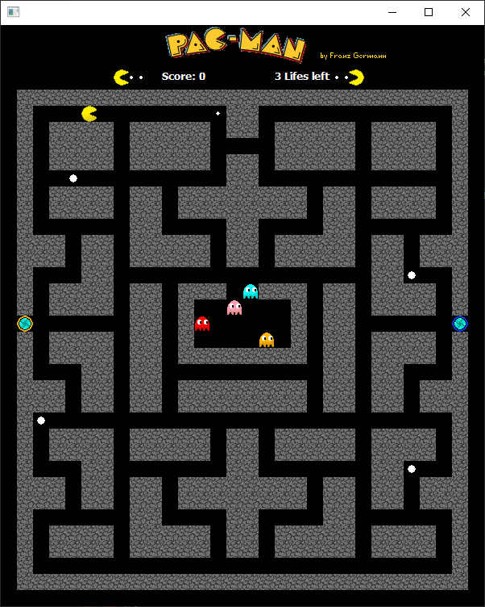

# Pacman

## Implementation

Language: Java

Framework: SWT

### About the game

The goal of the game Pacman is to collect all the little pills on the board, without getting caught by the 4 ghosts (Blinky, Pinky, Inky, Clyde).

When you collected all pills you get to the next level. If you beat the 3rd level, you get to the 1st level again. The only difference is the you move and the ghosts move faster.

Normally Blinky is the one who chases Pacman, in my game he just goes in the direction of Pacman.
Pinky and Inky are going in one direction until they hit a wall and the they move in a random direction.
Clyde move every step in a random direction.

At the beginning of the game Pacman has 3 lifes, if you die 3 times you're GameOver.
You are able to eat the ghosts if you eat a power pellet.
In the middle of the board is a fruit that gives you extra points. It appears 5 seconds after the game started and disappears again after 12 seconds. With the portals on both left and right side you can teleport yourself to the other side.

To make points you can collect the little pills, eat the ghosts and collect the fruit in each level.

### Features

* Pacman with animations
* Score- and life count
* Power pellets to eat the ghosts
* Portals

### Controls

WASD - controls the directions of Pacman

ENTER - start a new game (just works when gameOver)

### Problems

* Board has a fixed size because the GUI around the board is an image.
* ghosts are not that smart (maybe A* later)

